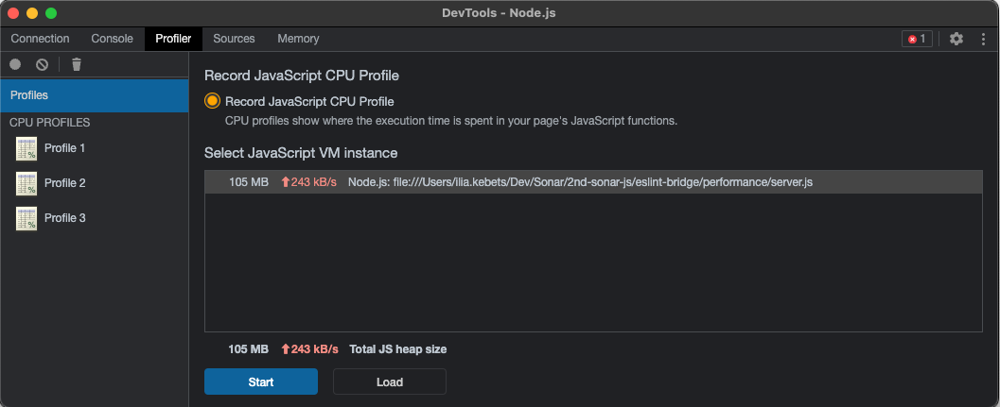
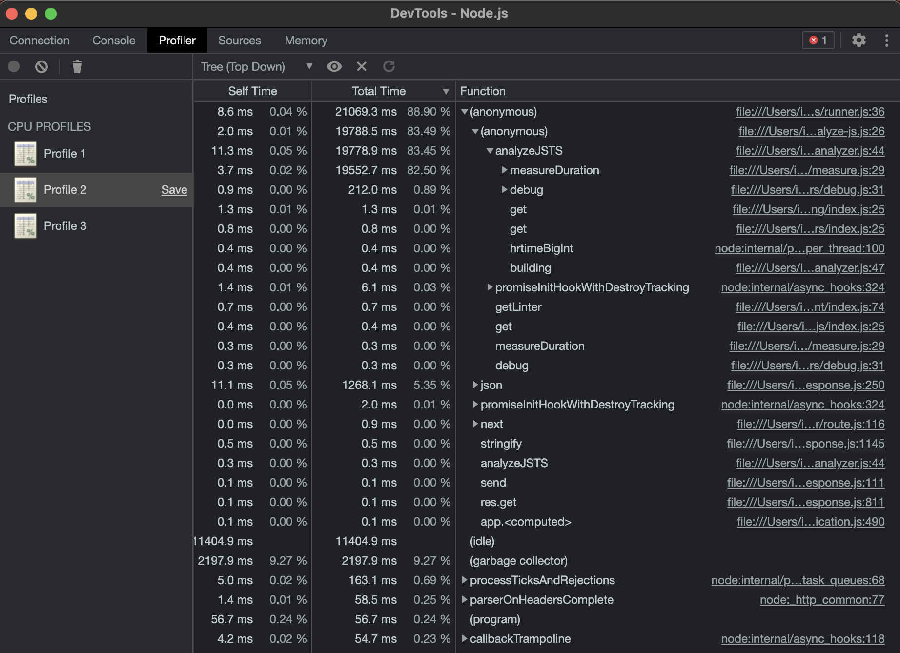
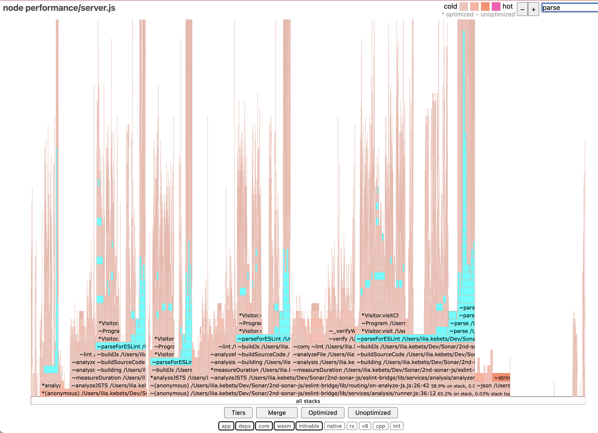

# ESlint-bridge performance benchmarking

## Links

- [Chrome profiling](https://medium.com/@basakabhijoy/debugging-and-profiling-memory-leaks-in-nodejs-using-chrome-e8ece4560dba)
- [Flame graphs with 0x](https://github.com/davidmarkclements/0x)
- [NodeJS profiling](https://nodejs.org/en/docs/guides/simple-profiling/)

### Chrome profiling

1. Boot the server in debug mode: `node --inspect-brk performance/server.js`
2. Open dev tools on chrome, using F12
3. You should see a green NodeJS icon like that, click it to connect the dev tools to the server's debugger:

4. You might need to make sure the server starts by going to the "sources" tab and pressing the "play" button
5. In the server logs, you should see that the server is listening
6. Select the "Profiler" tab
5. Select "Profiles" on the left
6. Press "Start" on the bottom

7. Launch the Analysis: `../node_modules/.bin/ts-node analyze.ts`
8. Press "Stop"
9. View the profile
10. Change the view from "Heavy (Bottom Up)" to "Tree (Top Down)" (on the top menu, above "Self Time")

### Flame graphs

1. Install 0x: `npm i 0x -D`
2. Boot the server with 0x monitoring: `./node_modules/.bin/0x performance/server.js`
3. Launch the analysis: `../node_modules/.bin/ts-node analyze.ts`
4. SIGINT the server process with CTRL+C
5. Open the generated web page in `<pid>.0x`

